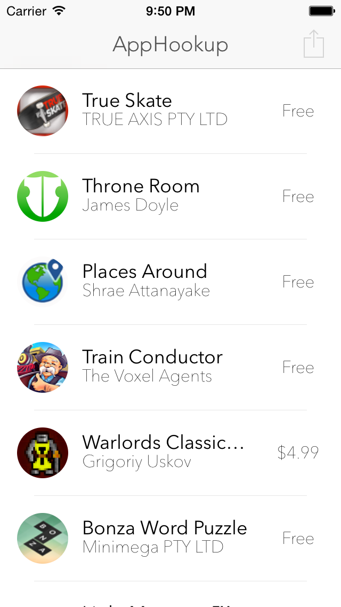
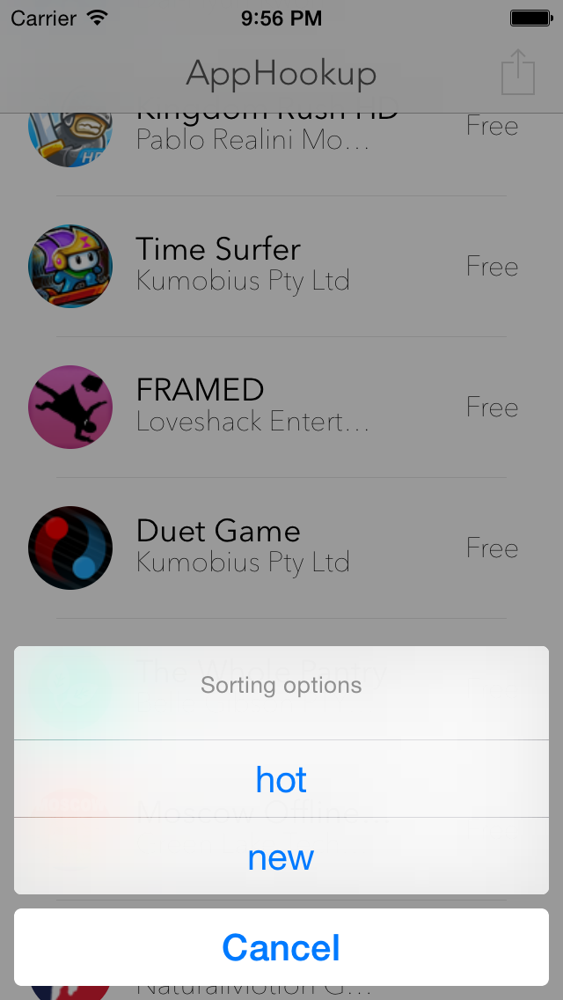

# AppHookupSwift
A small project to give Swift a try: get the apps from [/r/AppHookup](http://www.reddit.com/r/AppHookup/) on your iPhone.
Don't expect too much from this project. It's just an afternoon project in order to get my head around Swift... and still build something relatively useful!

## Screenshots

 

## Resources
* [Developing iOS 8 Apps with Swift – Stanford iTunes U](https://itunes.apple.com/hk/course/developing-ios-8-apps-swift/id961180099)
* [The Swift programming language](https://developer.apple.com/library/ios/documentation/Swift/Conceptual/Swift_Programming_Language/)
* [Reddit API documentation](https://www.reddit.com/dev/api)
* [iTunes Search API](https://www.apple.com/itunes/affiliates/resources/documentation/itunes-store-web-service-search-api.html)

## Contact
You can reach by [email](mailto:birslip@gmail.com) or on [twitter](https://twitter.com/birslip)! Don't hesitate to say hi :)